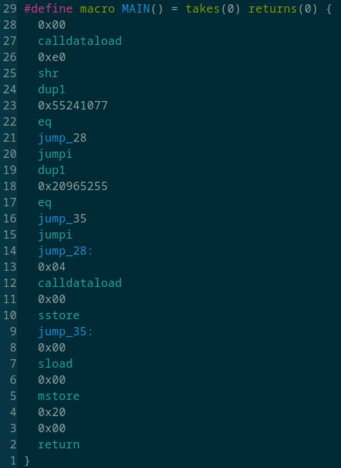

# Murph - Transpile EVM bytecode into huff

Murph can transpile this:

`60003560e01c8063552410771461001c5780632096525514610023575b6004356000555b60005460005260206000f`

into this:

## Installation

`cargo install --git https://github.com/iFrostizz/murph.git`

## TODO:

- [ ] Writing more tests
- [ ] Breaking big chunks into small functions
- [ ] Make JUMP / JUMPI pc fetch more smart
- [ ] Ignore init code
